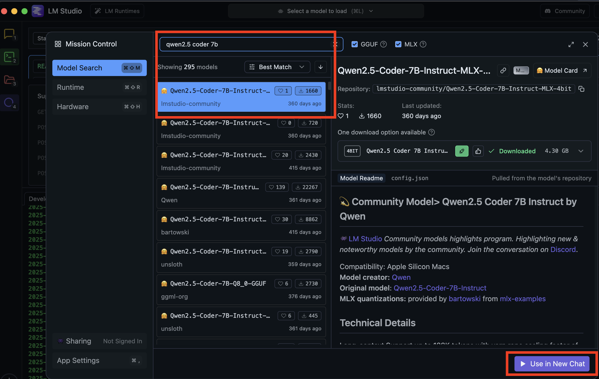
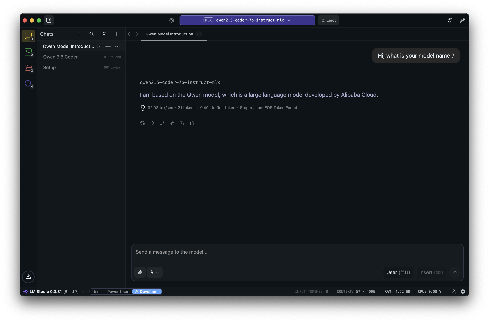
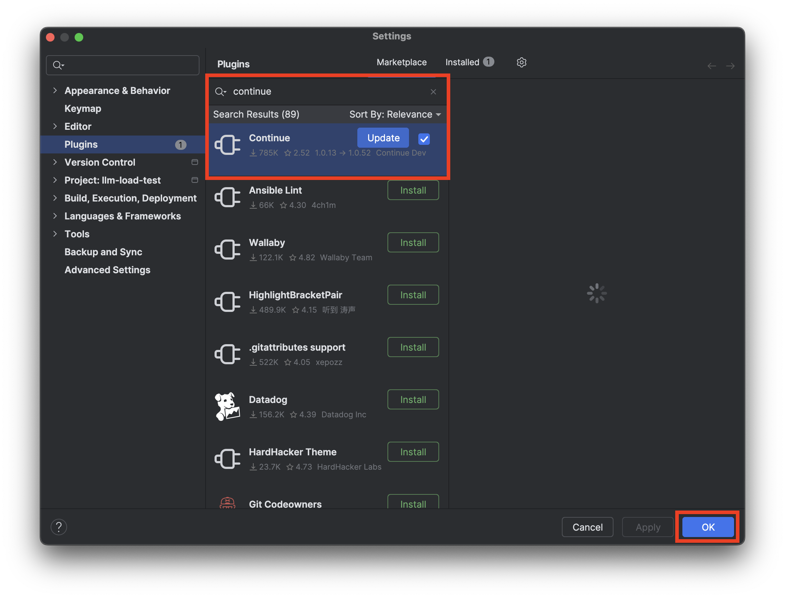
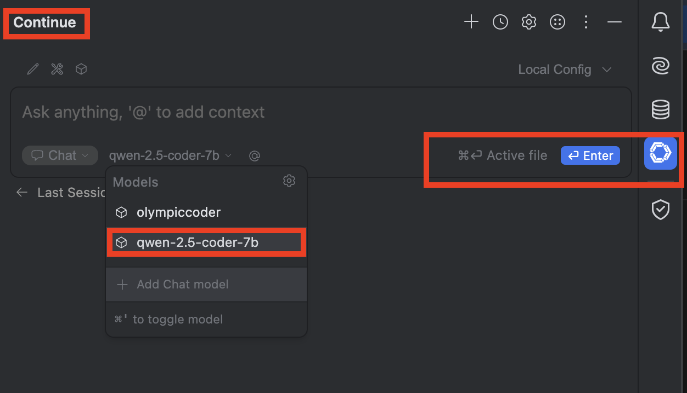
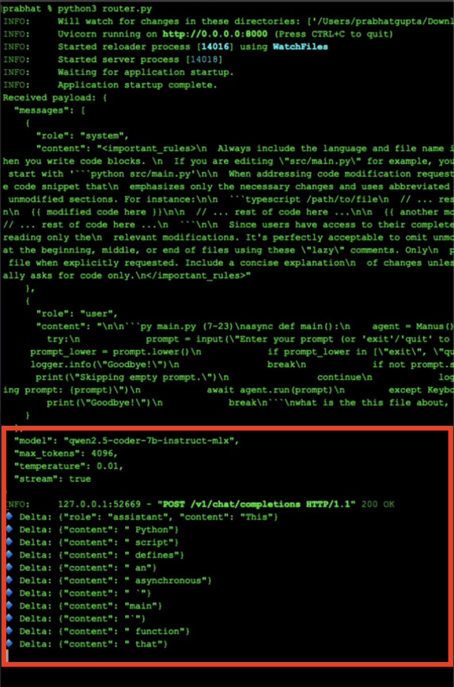

<div align="center">

# 🚀 Open-Cursor

### Your Free, Open-Source AI Coding Assistant

[](https://github.com/prabhatkgupta/open-cursor)
[](LICENSE)
[]()

**Privacy-First • Cost-Free • Fully Customizable**

[Quick Start](#-quick-start) • [Features](#-why-open-cursor) • [Demo](#-demo) • [Troubleshooting](#-troubleshooting)

</div>

---

## 📖 Table of Contents

- [Why Open-Cursor?](#-why-open-cursor)
- [Quick Start](#-quick-start)
  - [Step 1: LM Studio Setup](#step-1-setting-up-lm-studio-)
  - [Step 2: Continue Plugin](#step-2-installing-continue-plugin-)
  - [Step 3: Router Bridge](#step-3-creating-the-router-bridge-)
- [Demo](#-demo)
- [Customization](#-customization--advanced-usage)
- [Troubleshooting](#-troubleshooting)
- [Resources](#-resources--links)

---

## 🌟 Why Open-Cursor?

In the age of AI-powered coding assistants, tools like [Cursor](https://cursor.com) have revolutionized how developers write code. But what if you could have **all that power** without the compromises?

<table>
<tr>
<td width="50%" valign="top">

### 🔒 **Privacy & Security**
Your code never leaves your machine. No cloud servers, no data collection, no privacy concerns.

### 💰 **Cost-Effective**
No monthly subscriptions or API costs. Once set up, it's **completely free** to use.

</td>
<td width="50%" valign="top">

### 🎛️ **Full Control**
Choose your own models, customize system prompts, and modify behavior to suit your needs.

### 🌍 **Open-Source**
Built on open-source technologies, giving you transparency and freedom to modify.

</td>
</tr>
</table>

> **Perfect for:** Sensitive projects • Avoiding subscription fatigue • Open-source philosophy advocates

---

## ⚡ Quick Start

Setting up Open-Cursor takes about **5-10 minutes**. Follow these three simple steps:

### Step 1: Setting Up LM Studio 🧠


**LM Studio** makes running large language models locally a breeze. It's your AI brain running on your machine.

#### 📥 Download & Install

Visit **[lmstudio.ai](https://lmstudio.ai/)** and download for your OS (macOS, Windows, or Linux).

<div align="center">

</div>

#### 🎯 Choose Your Model

We recommend **Qwen2.5-Coder-7B-Instruct-MLX** - a 4-bit quantized model optimized for coding tasks.

**Why this model?**
- ⚡ Runs smoothly with under **10GB RAM**
- 🎯 Optimized specifically for coding tasks
- 📦 Only ~4.3GB download size

**Download:** [Qwen2.5-Coder-7B-Instruct-4bit](https://huggingface.co/mlx-community/Qwen2.5-Coder-7B-Instruct-4bit)


<div align="center">

</div>

#### 🚀 Serve Your Model

1. Open LM Studio
2. Navigate to **Model Search** → Search for `qwen2.5 coder 7b`
3. Download the **4-bit MLX version**
4. Go to **Chat Interface**
5. Load the Qwen2.5-Coder model
6. Start the local server (runs on `http://127.0.0.1:1234` by default)

<div align="center">
</div>

**✅ Test it:** Ask a simple coding question in the chat interface. If you get a coherent response, you're golden! 🎉

> **🎯 Checkpoint:** Your model is up. Now you got the 1st piece of the puzzle!

---

### Step 2: Installing Continue Plugin 🔌

Now let's integrate your AI brain with your IDE. This guide uses **PyCharm**, but works similarly with VS Code and other IDEs.

#### 📦 Install the Plugin

1. Open PyCharm
2. Navigate to: **Settings → Plugins → Marketplace**
3. Search for **"Continue"**
4. Click **Install**

<div align="center">

</div>

**Plugin Link:** [Continue for JetBrains](https://plugins.jetbrains.com/plugin/22707-continue)

#### ⚙️ Configure the Plugin

I've prepared a **ready-to-use** configuration file - no modifications needed! 😃

**Config file:** [`config.yaml`](https://github.com/prabhatkgupta/open-cursor/blob/main/continue/config.yaml)


**What's included:**
- ✅ Model specifications
- ✅ Chat templates  
- ✅ System prompts
- ✅ API endpoints
- ✅ Version information

#### 📂 Where to Place the Config

Copy `config.yaml` to your Continue configuration directory:

| Platform | Path |
|----------|------|
| **macOS/Linux** | `~/.continue/config.yaml` |
| **Windows** | `C:\Users\YourUsername\.continue\config.yaml` |

> 💡 **Tip:** Not sure about the exact path? Ask ChatGPT: *"Where is the Continue config file stored on [your OS]?"*

<div align="center">

</div>

**✅ Verification:** Once configured, you'll see the model listed in Continue's agent space!

---

### Step 3: Creating the Router Bridge 🌉

This is the **magic ingredient** that ties everything together! The router acts as intelligent middleware.

#### 🎯 What Does the Router Do?

```
Continue Plugin → Router → LM Studio → Router → Continue Plugin
    (Request)              (AI Model)            (Response)
```

The router:
1. **Receives** requests from Continue plugin
2. **Compiles** and formats them appropriately  
3. **Routes** to your local LM Studio model
4. **Streams** responses back token-by-token for real-time experience

#### 📝 Get the Router Code

**Router Script:** [`router.py`](https://github.com/prabhatkgupta/open-cursor/blob/main/scripts/router.py)

#### 🚀 Run the Router

Simply execute:

```bash
python3 router.py
```

<div align="center">

</div>

**What you'll see:**
- Green text showing streaming responses flowing through
- Real-time token-by-token delivery
- Smooth, premium-tool-like experience

---

## 🎯 Putting It All Together

Once all three components are running:

<table>
<tr>
<td width="33%" align="center">

### ✅ LM Studio


Local model serving

</td>
<td width="33%" align="center">

### ✅ Continue Plugin


IDE integration active

</td>
<td width="33%" align="center">

### ✅ Router


Communication flowing

</td>
</tr>
</table>

### 🎉 You Can Now:

- 💬 Ask coding questions directly in your IDE
- 🤖 Get AI-powered code completions
- 🔄 Request refactoring suggestions
- 📝 Generate code snippets
- 🐛 Debug with AI assistance

**All of this happens locally, privately, and at no cost!** 🎉

---

## 🎬 Demo

See Open-Cursor in action! Watch how seamlessly it integrates into your workflow:

**[📺 Watch Demo Video](https://drive.google.com/file/d/1qlSAt8Py7Hz5mvhomrupjTrUkTkGWNP8/view?usp=sharing)** 😃

<div align="center">
<a href="https://drive.google.com/file/d/1qlSAt8Py7Hz5mvhomrupjTrUkTkGWNP8/view?usp=sharing">
  
</a>
</div>

---

## 🛠️ Customization & Advanced Usage

The beauty of Open-Cursor is its **flexibility**. Here's how to make it truly yours:

### 🎨 Try Different Models

<table>
<tr>
<td>

**Want faster responses?**  
Try smaller models (3B or 1B variants)

</td>
<td>

**Need more accuracy?**  
Download larger models (13B, 32B+)

</td>
<td>

**Language-specific?**  
Find domain-specific models on [Hugging Face](https://huggingface.co)

</td>
</tr>
</table>

### ✏️ Modify System Prompts

Edit `config.yaml` to customize AI behavior:

```yaml
systemPrompt: |
  You are an expert Python developer.
  - Use type hints
  - Follow PEP 8
  - Write docstrings
  - Prefer list comprehensions
```

### 🔧 Run Multiple Models

Serve different models for different purposes:

| Use Case | Recommended Model |
|----------|-------------------|
| 💻 Code Generation | Qwen2.5-Coder-7B |
| 📚 Documentation | CodeLlama-7B |
| 🐛 Debugging | DeepSeek-Coder-6B |

---

## 🔧 Troubleshooting

<details>
<summary><b>🚫 Model not responding?</b></summary>

- ✅ Check if LM Studio server is running
- ✅ Verify port numbers match in your config (`1234` is default)
- ✅ Ensure model is loaded and active
- ✅ Check firewall isn't blocking localhost connections

</details>

<details>
<summary><b>🐌 Slow responses?</b></summary>

- ✅ Consider using a smaller model (1B-3B parameters)
- ✅ Check RAM usage - close other heavy applications
- ✅ Ensure no other heavy processes are running
- ✅ Try reducing `max_tokens` in config

</details>

<details>
<summary><b>🔌 Router connection errors?</b></summary>

- ✅ Confirm router script is running (`python3 router.py`)
- ✅ Check firewall settings
- ✅ Verify API endpoints in `config.yaml`
- ✅ Ensure LM Studio is serving on correct port

</details>

<details>
<summary><b>⚠️ Continue plugin not showing model?</b></summary>

- ✅ Verify `config.yaml` is in correct location
- ✅ Restart PyCharm/IDE after config changes
- ✅ Check YAML syntax is valid
- ✅ Look at Continue plugin logs for errors

</details>

---

## 🚀 What's Next?

This is just the beginning! Here's how to extend your setup:

<table>
<tr>
<td>

### 🔮 Future Enhancements

- [ ] Add multiple models for different tasks
- [ ] Integrate with Git for commit messages
- [ ] Create custom prompts library
- [ ] Build team-specific coding standards
- [ ] Develop additional router tools

</td>
<td>

### 🤝 Contribute

**Found a bug?** Open an issue!  
**Have an idea?** Submit a PR!  
**Want to help?** Check open issues!

Join us in building the future of open-source AI coding tools!

</td>
</tr>
</table>

---

## 📚 Resources & Links

<div align="center">

### Essential Links

[](https://github.com/prabhatkgupta/open-cursor)
[](https://lmstudio.ai/)
[](https://plugins.jetbrains.com/plugin/22707-continue)
[](https://huggingface.co/mlx-community/Qwen2.5-Coder-7B-Instruct-4bit)

</div>

### 📖 Documentation

| Resource | Description |
|----------|-------------|
| [Config File](https://github.com/prabhatkgupta/open-cursor/blob/main/continue/config.yaml) | Ready-to-use Continue configuration |
| [Router Script](https://github.com/prabhatkgupta/open-cursor/blob/main/scripts/router.py) | Python-based routing middleware |
| [Examples](https://github.com/prabhatkgupta/open-cursor/tree/main/examples) | Screenshots and usage examples |

---

## 🌟 Conclusion: Code Freely, Code Privately

Open-Cursor represents more than just a free alternative to commercial tools - it's a **statement** about:

<div align="center">

| 🔓 Software Freedom | 🔒 Privacy First | 🌍 AI Democratization |
|:-------------------:|:----------------:|:---------------------:|
| No vendor lock-in | Your code stays yours | Enterprise AI for everyone |

</div>

The initial setup takes just a few minutes, but the benefits - **privacy, cost savings, and customization** - make it worthwhile for any developer serious about their craft.

**Give it a try, and experience the future of coding on your own terms!** 💻✨

---

<div align="center">

### ⭐ Show Your Support

If you found this helpful, **star the repository** and share it with fellow developers who value open-source and privacy!

[](https://github.com/prabhatkgupta/open-cursor)

---

**Have questions or want to contribute?**

[Open an Issue](https://github.com/prabhatkgupta/open-cursor/issues) • [Submit a PR](https://github.com/prabhatkgupta/open-cursor/pulls) • [Join Discussions](https://github.com/prabhatkgupta/open-cursor/discussions)

---

*Thanks for reading! Go build your personal free Open-Cursor today* 🚀

**Made with ❤️ by the Open-Source Community**

</div>
